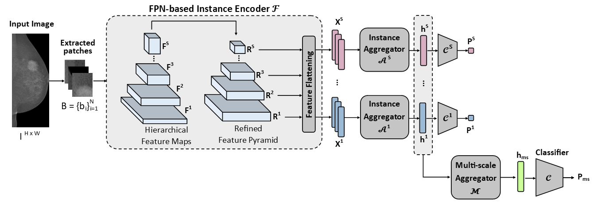

# Multi-scale Attention-based Multiple Instance Learning (MIL)

This repository contains the **official implementation** of the paper:

📄 [**"Multi-scale Attention-based Multiple Instance Learning for Breast Cancer Diagnosis"**](https://link.springer.com/chapter/10.1007/978-3-032-05182-0_36)

Accepted at the **MICCAI 2025** conference for oral presentation and poster session. 



The proposed multi-scale attention-based MIL framework has three main modules, namely: 
- **Multi-scale instance encoder:** Uses the original Feature Pyramid Network (FPN) to produce a semantically refined feature pyramid. Instances are defined as the set of pixels in the feature maps at reduction factors 16, 32 and 128, enabling a multi-scale analysis across different receptive-field granularities.  

- **Instance aggregators:** Aggregate instance features into a corresponding bag embedding at each analyzed scale. Both AbMIL and SetTrans were considered in the experiments, each having an encoder and a pooling stage.  

- **Multi-scale aggregator:** Aggregates the scale-specific bag embeddings into a multi-scale bag embedding, which is then used for the final image classification.


## Repository Structure

```plaintext
Multi-scale-Attention-based-MIL/
│── Datasets/                  
│   ├── dataset_concepts.py                 # Dataset classes for MIL classification & lesion detection   
│   └── dataset_utils.py                    # Data preprocessing & loading    
│── Feature_Extractors/                   
│   ├── __init__.py                         # Load feature extractor  
│   ├── FPN.py                              # Feature Pyramid Network
│   └── mammoclip/                          
│       ├── __init__.py                     # Load pre-trained MammoCLIP image encoder
│       ├── efficient_net_custom_utils.py   # Helper functions for EfficientNet 
│       └── efficientnet_custom.py          # Modified EfficientNet implementation 
│── MIL/                                    
│   ├── __init__.py                         # Build & configure MIL model
│   ├── MIL_models.py                       # MIL model architectures
│   ├── AttentionModels.py                  # Attention-based MIL modules   
│   ├── MIL_experiment.py                   # MIL classification training & evaluation 
│   ├── inference_MIL_classifier.py         # MIL classification inference   
│   └── roi_eval.py                         # Lesion detection MIL evaluation 
│── utils/                                  
│   ├── data_split_utils.py                 # Data splitting utilities    
│   ├── generic_utils.py                    # General-purpose utilities 
│   ├── plot_utils.py                       # Plotting & visualization 
│   ├── training_setup_utils.py             # Training setup & configuration
│   └── metrics.py                          # Evaluation metrics 
│── vindrmammo_grouped_df.csv               # Dataset metadata (e.g. file names & labels)  
│── main.py                                 # Main script to train & evaluate implemented models 
│── offline_feature_extraction.py           # Script for offline feature extraction  
````

# Data Download

As mentioned in the paper, this work uses the preprocessed images provided by Ghosh et al. in their Mammo-CLIP work. 
- [Link to input images](https://www.kaggle.com/datasets/shantanughosh/vindr-mammogram-dataset-dicom-to-png)

The code assumes the following organization of folders and files: `data_dir` folder is the root directory of the dataset, where it is stored the [vindrmammo_grouped_df.csv](vindrmammo_grouped_df.csv) file with metadata information (patient id, image paths, annotated lesions, etc.) for the downstream tasks (image classification and lesion detection), besides also the `img_dir` folder containing the input mammograms.

```plaintext
data_dir/
├── vindrmammo_grouped_df.csv
└── img_dir/
    ├── c7811f4575c1229ad4a7606de49ea68f/
    │   ├── 9eb4650a2b630e44074c403f6127c5a1.png
    │   ├── cc3fdc5d733a671f3000e20838e192d9.png
    │   ├── 181fd193d3b785dc9faafdaa8e1695fc.png
    │   └── 55eb5ea616abacd225e584ffc8be57da.png
    └── a1dd219b28806fc295fac20ceb147870/
        ├── 887cdcc99ebed66bd062ada6c8210152.png
        ├── 36f2921a2ac19eba7420c591c4c07ae4.png
        ├── 12dc17dfd9d30ea7c0c1ccb33a505085.png
        └── e22e4f297b4c82279e7b78a98417a6cd.png
````

# Feature Extraction 

Following prior deep MIL models that handle large-size bags, the implemented framework uses the pretrained EfficientNet-B2 image encoder from the Mammo-CLIP work as the backbone for feature extraction. 
- [Link for the pretrained EfficientNet-B2](https://huggingface.co/shawn24/Mammo-CLIP/blob/main/Pre-trained-checkpoints/b2-model-best-epoch-10.tar)

After successfully downloading the image encoder checkpoint, you will need to set the --clip_chk_pt_path argument to the correct path. 

The implemented framework is compatible with both online and offline feature extraction. To perform offline feature extraction, run the following code:

```bash
python offline_feature_extraction.py \
  --clip_chk_pt_path "foundational_models/Mammo-CLIP-main/b2-model-best-epoch-10.tar" \ # Path to Mammo-CLIP's image encoder checkpoint
  --dataset 'ViNDr' \
  --arch 'upmc_breast_clip_det_b2_period_n_lp' \
  --csv-file 'vindrmammo_grouped_df.csv' \
  --feat_dir 'PreProcessedData/Vindir-mammoclip/extracted_features' \
  --patching \ # Wether to perform patching on full-resolution images. If false, it will consider previously extracted patches that were saved in a directory
  --patch_size 512 \ 
  --overlap 0.0 \
  --multi_scale_model 'fpn'
```

# Code examples 

Bellow, we provide code examples to perform different tasks for specific lesion types, particularly focusing on our best-performing FPN-MIL model configurations. 

<details> <summary>MIL training</summary>

MIL performs an image classification task. By default, feature extraction is performed **offline**, meaning that the framework receives pre-extracted features as input (see the Feature Extraction section above).  

Alternatively, feature extraction can be set to **online**, in which case the framework receives images directly as input. In the online mode, the backbone can be either **frozen** or **finetuned**, controlled by the `--training_mode` argument (default is `"frozen"`, but it can also be set to `"finetune"`).  

Please refer to the `main.py` file to see the full range of available arguments.

- **Best-performing configuration for Calcifications**
```bash
python main.py \
  --data-dir "datasets/Vindir-mammoclip" \
  --img-dir "VinDir_preprocessed_mammoclip/images_png" \
  --csv-file "vindrmammo_grouped_df.csv" \
  --dataset 'ViNDr' \
  --label "Suspicious_Calcification" \
  --clip_chk_pt_path "foundational_models/Mammo-CLIP-main/b2-model-best-epoch-10.tar" \
  --train \
  --feature_extraction "offline" \ 
  --epochs 30 \
  --batch-size 8 \
  --eval_scheme 'kruns_train+val+test' \
  --n_runs 1 \
  --lr 5.0e-5 \
  --weighted-BCE 'y' \
  --mil_type 'pyramidal_mil' \
  --multi_scale_model 'fpn' \
  --fpn_dim 256 \
  --fcl_encoder_dim 256 \
  --fcl_dropout 0.25 \
  --type_mil_encoder 'isab' \
  --trans_layer_norm True \
  --pooling_type 'pma' \
  --drop_attention_pool 0.25 \
  --type_scale_aggregator 'gated-attention' \
  --deep_supervision \
  --scales 16 32 128
```

- **Best-performing configuration for Masses**
```bash
python main.py \
  --data-dir "datasets/Vindir-mammoclip" \
  --img-dir "VinDir_preprocessed_mammoclip/images_png" \
  --csv-file "vindrmammo_grouped_df.csv" \
  --dataset 'ViNDr' \
  --label "Mass" \
  --clip_chk_pt_path "foundational_models/Mammo-CLIP-main/b2-model-best-epoch-10.tar" \
  --train \
  --feature_extraction "offline" \ 
  --epochs 30 \
  --batch-size 8 \
  --eval_scheme 'kruns_train+val+test' \
  --n_runs 1 \
  --lr 5.0e-5 \
  --weighted-BCE 'y' \
  --mil_type 'pyramidal_mil' \
  --multi_scale_model 'fpn' \
  --fpn_dim 256 \
  --fcl_encoder_dim 256 \
  --fcl_dropout 0.25 \
  --pooling_type 'gated-attention' \
  --drop_attention_pool 0.25 \
  --type_scale_aggregator 'gated-attention' \
  --deep_supervision \
  --scales 16 32 128 
```

- `data-dir`: root directory of the dataset
- `img-dir`: directory containing images, absolute path
- `csv-file`: csv file containing image paths and labels
- `dataset`: dataset name, e.g. ViNDr 
- `label`: target label for classification, e.g., Mass, Suspicious_Calcification
- `clip_chk_pt_path`: path to the checkpoint of the pre-trained Mammo-CLIP model

  
</details>

<details> <summary>Post-hoc lesion detection evaluation </summary> 

Lesion detection is performed as a post-hoc analysis of the generated heatmaps (at each scale and at the multi-scale aggregated level).  

**Note:** For the lesion detection post-hoc analysis, feature extraction is set to **online** in order to define a higher percentage of overlap between extracted patches. This allows the generation of more fine-grained heatmaps, where the attention scores in overlapped regions are accumulated and averaged.

- **Best-performing configuration for Calcifications**
```bash
python main.py \
--data-dir "datasets/Vindir-mammoclip" \
--img-dir "VinDir_preprocessed_mammoclip/images_png" \
--csv-file "vindrmammo_grouped_df.csv" \
--dataset 'ViNDr' \
--label "Suspicious_Calcification" \
--clip_chk_pt_path "foundational_models/Mammo-CLIP-main/b2-model-best-epoch-10.tar" \
--roi_eval \
--resume <path-to-model-checkpoint> \
--feature_extraction 'online' \
--patch_size 512 \
--overlap 0.75 \
--mil_type 'pyramidal_mil' \
--multi_scale_model 'fpn' \
--fpn_dim 256 \
--fcl_encoder_dim 256 \
--fcl_dropout 0.25 \
--type_mil_encoder 'isab' \
--trans_layer_norm True \
--pooling_type 'pma' \
--drop_attention_pool 0.25 \
--type_scale_aggregator 'gated-attention' \
--deep_supervision \
--scales 16 32 128 
```

- **Best-performing configuration for Masses**
```bash
python main.py \
--data-dir "datasets/Vindir-mammoclip" \
--img-dir "VinDir_preprocessed_mammoclip/images_png" \
--csv-file "vindrmammo_grouped_df.csv" \
--dataset 'ViNDr' \
--label "Mass" \
--clip_chk_pt_path "foundational_models/Mammo-CLIP-main/b2-model-best-epoch-10.tar" \
--roi_eval \
--resume <path-to-model-checkpoint> \
--feature_extraction 'online' \
--patch_size 512 \
--overlap 0.75 \
--mil_type 'pyramidal_mil' \
--multi_scale_model 'fpn' \
--fpn_dim 256 \
--fcl_encoder_dim 256 \
--fcl_dropout 0.25 \
--pooling_type 'gated-attention' \
--drop_attention_pool 0.25 \
--type_scale_aggregator 'gated-attention' \
--deep_supervision \
--scales 16 32 128 
```

- `data-dir`: root directory of the dataset
- `img-dir`: directory containing images, absolute path
- `csv-file`: csv file containing image paths and labels
- `dataset`: dataset name, e.g. ViNDr 
- `label`: target label for classification, e.g., Mass, Suspicious_Calcification
- `clip_chk_pt_path`: path to the checkpoint of the pre-trained Mammo-CLIP model


</details>

# Tutorial Notebooks

To ensure fully reproducible results, notebooks are provided to run the code for all tasks (image classification and lesion detection) and for all experiments (comparison with baselines and ablation studies) performed.

- [Experiments_Calcifications.ipynb](notebooks/Experiments_Calcifications.ipynb)
- [Experiments_Masses.ipynb](notebooks/Experiments_Masses.ipynb)

Besides, to load our best checkpoint models for each lesion type (FPN-SetTrans for calcifications and FPN-AbMIL for masses), consider the following notebook: 
- [Load_checkpoints.ipynb](notebooks/Load_checkpoints.ipynb)

# Checkpoints

We provide pre-training checkpoints for our best-performing models.  

|Description         | Checkpoints |
|--------------------|-------------|
| Best model for calcifications | [FPN-SetTrans](https://drive.google.com/file/d/1pcr5wa8cI7R8L-7MfkXBEBB2IE02NmMI/view?usp=sharing) |
| Best model for masses | [FPN-AbMIL](https://drive.google.com/file/d/1ptgub09TjB2oCpm2ij2OyaVDKT_5y8D0/view?usp=sharing) |

## ⏳ Coming Soon (under construction) 
- [ ] Jupyter Notebooks to reproduce **MICCAI 2025 results**

## Reference 

If you find our work useful in your research or if you use parts of this code, please use the following BibTeX entry.

```plaintext
@InProceedings{MouMar_Multiscale_MICCAI2025,
        author = { Mourão, Mariana AND Nascimento, Jacinto C. AND Santiago, Carlos AND Silveira, Margarida},
        title = { { Multi-scale Attention-based Multiple Instance Learning for Breast Cancer Diagnosis } },
        booktitle = {proceedings of Medical Image Computing and Computer Assisted Intervention -- MICCAI 2025},
        year = {2025},
        publisher = {Springer Nature Switzerland},
        volume = {LNCS 15974},
        month = {September},
        page = {364 -- 374}
}
````
